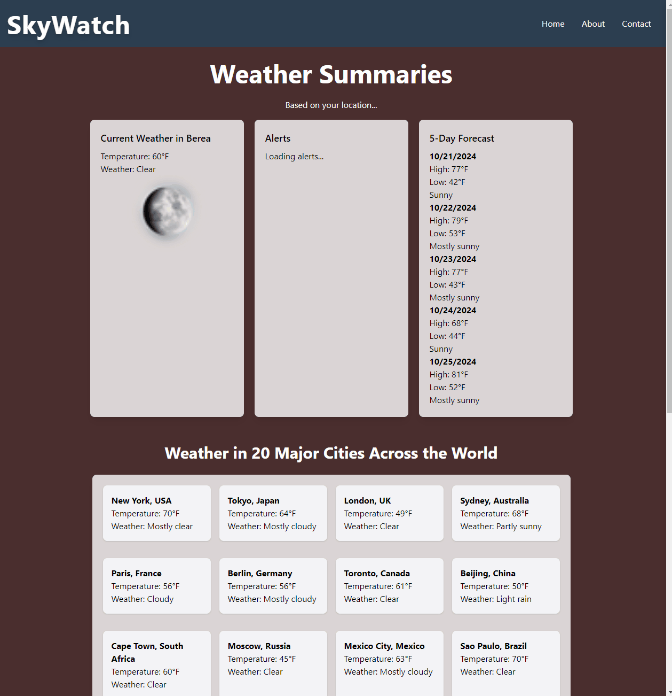

# Web Development Project 5 - *SkyWatch*

Submitted by: **Ali Ramazani**

This web app: **A weather dashboard application that fetches real-time weather data from a public API. Users can view current weather conditions based on their location, view weather conditions in 20 major cities across the globe, and search for weather information by city, and apply various filters to customize the displayed data.**

Time spent: **3** hours spent in total

## Required Features

The following **required** functionality is completed:

- [✅] **The list displays a list of data fetched using an API call**
- [✅] **Data uses the useEffect React hook and async/await syntax**
- [✅] **The app dashboard includes at least three summary statistics about the data such as**
  - [ ] *insert details*
- [✅] **A search bar allows the user to search for an item in the fetched data**
- [✅] **Multiple different filters (2+) allow the user to filter items in the database by specified categories**

The following **optional** features are implemented:

- [✅] Multiple filters can be applied simultaneously
- [✅] Filters use different input types such as a text input, a selection, or a slider
- [✅] The user can enter specific bounds for filter values

## Video Walkthrough

Here's a walkthrough of implemented user stories:

<!-- Replace this with whatever GIF tool you used! -->
GIF created with ...  

[ScreenToGif](https://www.screentogif.com/) for Windows

## Notes

One challenge I faced was with debugging as the API was rate-limited and I had to wait for a while to test my code. Moreover, I had to use a proxy server to bypass CORS issues.

## License

    Copyright [2024] [Ali Ramazani]

    Licensed under the Apache License, Version 2.0 (the "License");
    you may not use this file except in compliance with the License.
    You may obtain a copy of the License at

        http://www.apache.org/licenses/LICENSE-2.0

    Unless required by applicable law or agreed to in writing, software
    distributed under the License is distributed on an "AS IS" BASIS,
    WITHOUT WARRANTIES OR CONDITIONS OF ANY KIND, either express or implied.
    See the License for the specific language governing permissions and
    limitations under the License.

