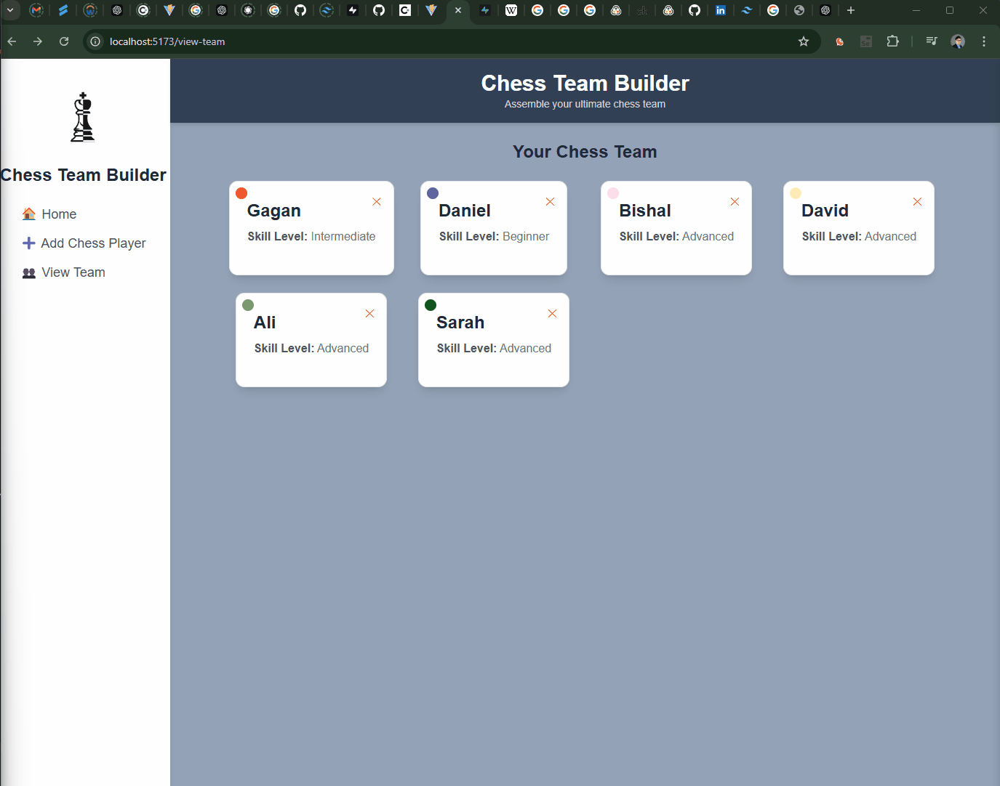

# Web Development Project 7 - *ChessTeamBuilder*

Submitted by: **Ali Ramazani**

This web app: **allows users to add teammates for their chess games. The app allows for all CRUD operations (Create, Read, Update, and Delete).**

Time spent: **6.5** hours spent in total

## Required Features

The following **required** functionality is completed:

- [✅] **A create form allows users to add new cremates**
- [✅] **Users can name the crewmate and set the crewmate's attributes by clicking on one of several values**
- [✅] **The site displays a summary page of all the user's added crewmates**
- [✅] **A previously created crewmate can be updated from the crewmate list**
- [✅] **A previously created crewmate can be deleted from the crewmate list**
- [✅] **Each crewmate has a direct, unique link to an info page about them**

The following **optional** features are implemented:

- [ ] A crewmate can be given a category upon creation which restricts their attributes
- [ ] The site displays summary statistics about a user's crew on their crew page 
- [ ] The site displays a custom "success" metric about a user's crew which changes the look of the crewmate list

## Video Walkthrough

Here's a walkthrough of implemented user stories:

<!-- Replace this with whatever GIF tool you used! -->
GIF created with ...  

[ScreenToGif](https://www.screentogif.com/) for Windows

## Notes

Describe any challenges encountered while building the app.

## License

    Copyright [2024] [Ali Ramazani]

    Licensed under the Apache License, Version 2.0 (the "License");
    you may not use this file except in compliance with the License.
    You may obtain a copy of the License at

        http://www.apache.org/licenses/LICENSE-2.0

    Unless required by applicable law or agreed to in writing, software
    distributed under the License is distributed on an "AS IS" BASIS,
    WITHOUT WARRANTIES OR CONDITIONS OF ANY KIND, either express or implied.
    See the License for the specific language governing permissions and
    limitations under the License.

Apollo
