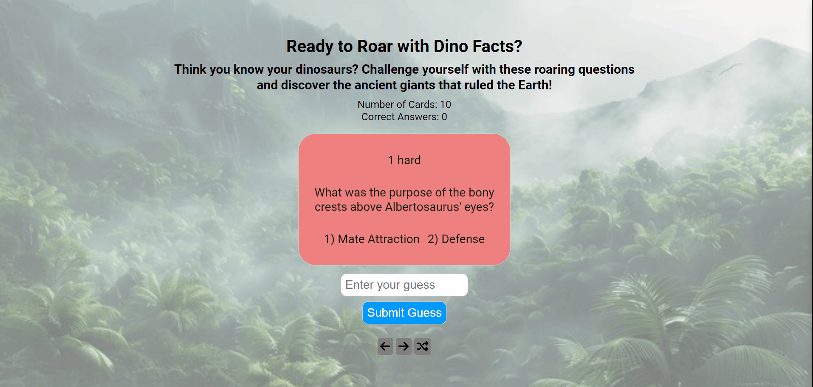

# Web Development Project 2 - *Dinosauriz*

Submitted by: **Ali Ramazani**

This web app: **This quizlet includes 10 questions about dinosaurs as well as answers to them. Questions are stored externally and can be added or removed with ease**

Time spent: **2.5** hours spent in setting up basic functionality
Time Spent: "2" hours spent in extending web functionality 

## Required Features

The following **required** functionality is completed:

- [T] **The title of the card set and some information about it, such as a short description and the total number of cards are displayed**
- [T] **A single card at a time is displayed, only showing one of the components of the information pair**
- [T] **A list of card pairs is created**
- [T] **Clicking on the card shows the corresponding component of the information pair**
- [T] **Clicking the next button displays next card**
- [T] **Clicking the back button displays previous card**
- [T] **A visual indicator, flash message, is displayed to notify user of the correct ness of their answer**

The following **optional** features are implemented:

- [T] Cards contains images in addition to or in place of text
- [T] Cards have different visual styles such as color based on their category
  - [T] *visual style implemented*
  - [T] *User's guess is fuzze matched with the correct answer to allow for spelling mistakes**
  - [T] *Clicking the shuffle buttton shuffles the whole deck*
- [T] *User can input their guess**

## Video Walkthrough

Here's a walkthrough of implemented required features:

<!-- Replace this with whatever GIF tool you used! -->
GIF created with ...  
<!-- Recommended tools:
[Kap](https://getkap.co/) for macOS
[ScreenToGif](https://www.screentogif.com/) for Windows
[peek](https://github.com/phw/peek) for Linux. -->

## Notes

Describe any challenges encountered while building the app.

## License

    Copyright [2024] [Ali Ramazani]

    Licensed under the Apache License, Version 2.0 (the "License");
    you may not use this file except in compliance with the License.
    You may obtain a copy of the License at

        http://www.apache.org/licenses/LICENSE-2.0

    Unless required by applicable law or agreed to in writing, software
    distributed under the License is distributed on an "AS IS" BASIS,
    WITHOUT WARRANTIES OR CONDITIONS OF ANY KIND, either express or implied.
    See the License for the specific language governing permissions and
    limitations under the License.

