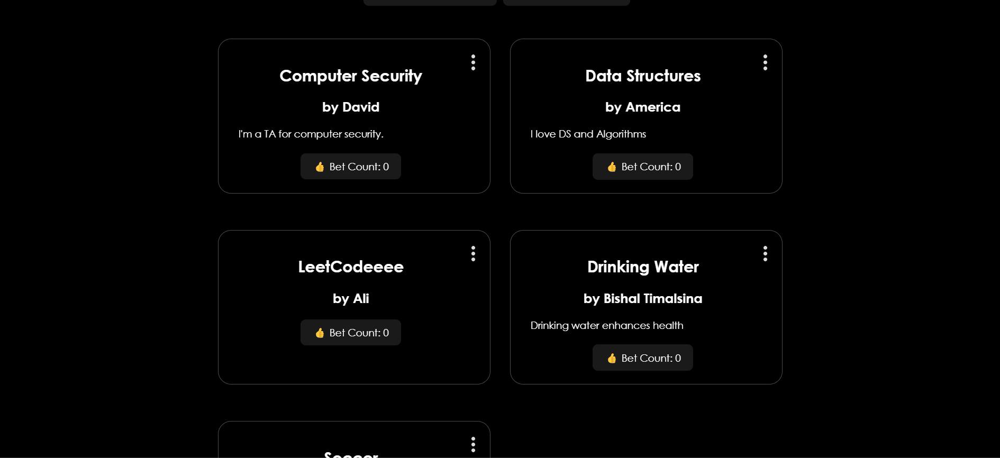

# Project Overview

I worked on this project to learn Supabase.

Supabase is an open-source database infrastructure that allows developers to build web, mobile, and AI applications:

- **Database**: A Postgres database, which is a relational database
- **Authentication**: Features for user sign-ups and logins, and data security
- **Storage**: Serverless storage and functions
- **Real-time**: Real-time subscriptions and instant API functionality
- **AI**: Toolkits for developing AI applications
- **Query language**: An SQL-based query language for data management
- **Custom functions**: Support for custom functions using PostgreSQL's PL/pgSQL language

